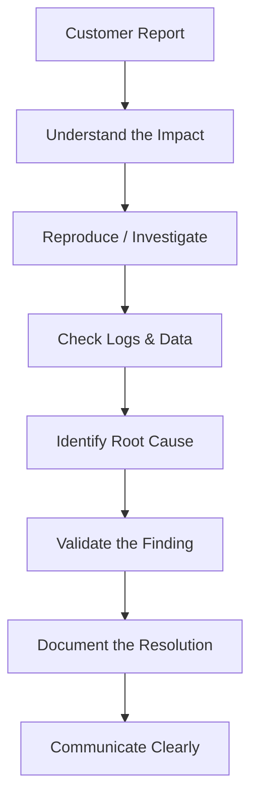
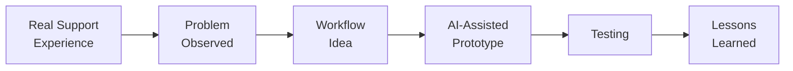
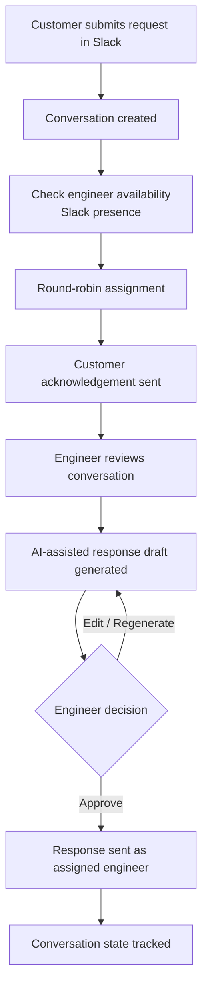
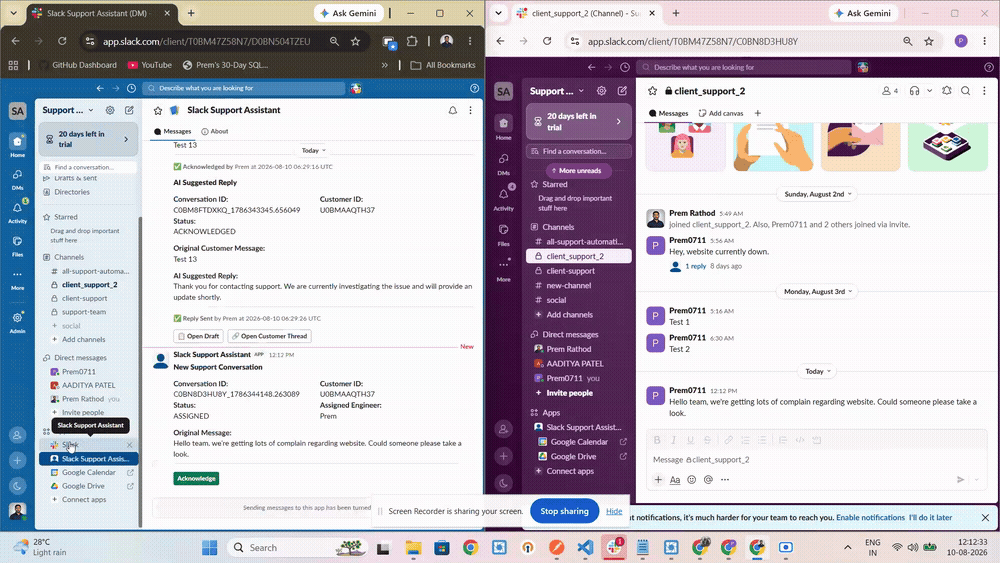
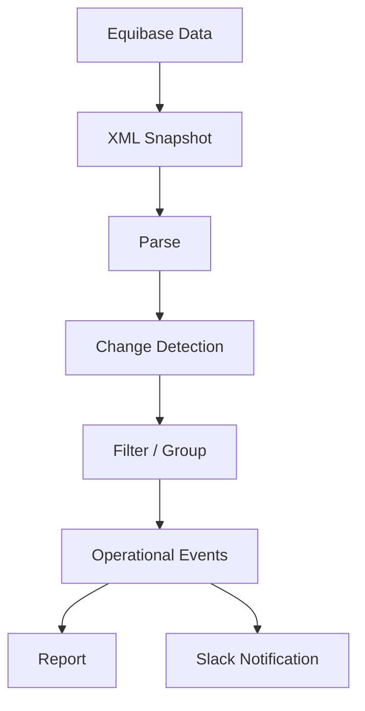

<h1 align="center">Hi, I'm Prem 👋</h1>
<h3 align="center">Technical / Application Support Engineer</h3>
<p align="center">Production Support · Incident Investigation · Root Cause Analysis · SQL · Automation · AI-Assisted Tooling</p>

<p align="center">
  
  
  
</p>

---

I work in production-facing technical support for SaaS platforms — investigating customer-impacting incidents, analysing logs and databases, troubleshooting integrations, and working with engineering teams to drive issues toward resolution.

My day-to-day involves understanding what happened in production, identifying the root cause, validating impact, and communicating technical findings clearly to both technical and non-technical stakeholders. I'm also interested in improving repetitive support workflows through automation and AI-assisted tooling — not as a developer, but as someone who understands the workflow and uses AI to help build practical prototypes around it.

---

## 🧭 What I Do

**Production & Application Support**
Incident investigation and troubleshooting · Root Cause Analysis (RCA) · Production issue monitoring · Customer-impacting issue investigation · Incident documentation · Engineering escalation and coordination

**Technical Investigation**
SQL / MySQL · GCP & log analysis · API troubleshooting · Postman · Firebase · Database investigation · Basic cloud and application troubleshooting

**Automation & AI-Assisted Workflows**
Support workflow automation · AI-assisted investigation and documentation · Workflow prototyping · Using AI tools to design and build practical support tooling

---

## 🧩 How I Approach Production Problems



This is the same structured thinking behind every project below — each one started as a real support problem, not a coding exercise.

---

## 🗺️ The Story Behind My Projects



I don't build software for its own sake. Each project below started with something I noticed in support work — a repetitive task, a slow handoff, a manual monitoring process that could be more consistent — and I used AI-assisted development to turn that observation into a working prototype: I define the problem, workflow, logic, and testing direction; AI assists with implementation.

---

## 🗃️ Featured Projects — Index

The section below is a control panel, not a full write-up. Each entry is the high-level signal; the implementation, tests, and design decisions live in the repository itself.

<table>
<tr>
<td width="50%" valign="top">

**01 — SLACK SUPPORT ASSISTANT**
`AI-ASSISTED SUPPORT WORKFLOW`

Round-robin conversation assignment, live availability checks, and AI-drafted replies for support engineers on Slack — the engineer always sends, the bot only assists.

<p>


</p>

[Repository →](https://github.com/prem0711-12/slack-support-assistant) · [Project Details →](#project-01-slack-support-assistant)

</td>
<td width="50%" valign="top">

**02 — EQUIBASE RACE-DAY CHANGE INFORMER**
`OPERATIONAL CHANGE DETECTION`

Polls Equibase race-day data, detects operational changes (scratches, jockey swaps, track condition), filters out noise, and pushes grouped alerts to Slack.

<p>


</p>

[Repository →](https://github.com/prem0711-12/equibase-race-day-change-informer) · [Project Details →](#project-02-equibase-race-day-change-informer)

</td>
</tr>
</table>

*More projects get added to this index the same way — number, one-liner, status, and links. No redesign required.*

---

<a id="project-01-slack-support-assistant"></a>
## 🔒 Project 01 — Slack Support Assistant — AI-Assisted Support Workflow Prototype

<p>
  
  
  
</p>

| | |
|---|---|
| **Problem** | Support teams handling incoming Slack conversations often assign requests manually, with no consistent check on who's actually available before a conversation lands on their queue. |
| **Approach** | Prototype a workflow where new Slack conversations are detected automatically, routed to an available engineer using round-robin logic, and tracked through acknowledgement and response — with AI assisting the engineer's response drafting, not replacing their judgment. |

**Workflow**



**What I experimented with**
- Excluding engineers from assignment based on real-time Slack presence, not just a static schedule
- Keeping AI in a drafting/assist role — every response is reviewed and approved by the engineer before sending, never auto-sent
- Tracking conversation and acknowledgement state through the full lifecycle, not just at creation

**Demo**



*Screen recording of the prototype: a new conversation comes in, availability is checked, an AI-suggested reply is generated, and the engineer approves and sends it.*

**Example system output**

<details>
<summary>Sanitized log excerpt (click to expand)</summary>

```text
Engineer availability check:
Prem       presence=active   -> eligible
Aditya     presence=away     -> excluded

New Conversation
Assigned Engineer: Prem
Status: ASSIGNED

Conversation Acknowledged
Acknowledged By: Prem
Status: ACKNOWLEDGED
```

</details>

**What I learned**
Building this clarified how much of "support automation" is really about designing the *decision logic* — who's eligible, when to escalate, when to hand control back to a human — rather than the AI generation step itself, which is the easy part.

**Repository:** [github.com/prem0711-12/slack-support-assistant](https://github.com/prem0711-12/slack-support-assistant) — full architecture, milestone history, and test coverage documented there.
**Focus:** Support workflow design · Automation · Slack workflows · AI-assisted tooling

[↑ Back to Featured Projects index](#-featured-projects--index)

---

<a id="project-02-equibase-race-day-change-informer"></a>
## 🛰️ Project 02 — Equibase Race-Day Change Informer — Operational Change Detection Pipeline

<p>
  
  
  
</p>

| | |
|---|---|
| **Problem** | Race-day data changes (scratches, jockey swaps, track condition) get published by Equibase continuously, but manually diffing raw XML snapshots to catch what actually matters operationally doesn't scale. |
| **Approach** | An operational monitoring pipeline that polls Equibase on a schedule, detects real changes between snapshots, filters out routine noise, groups related records into single events, and delivers the result as a report and a Slack notification. |

**Workflow**



**What it currently does**
- Downloads and timestamps Equibase's race-day change XML on a repeating schedule
- Parses raw XML into structured change records and classifies each as new, removed, modified, or unchanged against the previous snapshot
- Filters detected changes down to the ones that are operationally relevant (scratches, jockey changes, track condition, course/distance changes, cancellations) and groups noisy per-race records into single events
- Writes a human-readable + machine-readable report each cycle and sends the filtered, grouped events to Slack

**Example run — 6 operational events detected**

<details>
<summary>Sanitized run output (click to expand)</summary>

```text
NEW OPERATIONAL EVENTS: 6

SCRATCH                 — Emerald Downs
JOCKEY CHANGE           — Prairie Meadows
JOCKEY CHANGE           — Prairie Meadows
JOCKEY CHANGE           — Prairie Meadows
JOCKEY CHANGE           — Prairie Meadows
TRACK CONDITION CHANGE  — Prairie Meadows
```

</details>

**What's next**
Comparing Equibase's reported changes against an internal company system to flag mismatches is a planned future direction — it is **not** implemented in the current pipeline, which stops at detection, filtering, reporting, and Slack notification.

**Repository:** [github.com/prem0711-12/equibase-race-day-change-informer](https://github.com/prem0711-12/equibase-race-day-change-informer) — full phase-by-phase build log, data model, and test suite documented there.
**Focus:** Operational monitoring · Change detection · Data pipelines · Slack notifications

[↑ Back to Featured Projects index](#-featured-projects--index)

---

## 🗂️ Other Projects

<table>
<tr>
<td width="50%" valign="top">

**🌐 Prem Rathod — Portfolio**
*Problem:* Needed a single place to present my technical projects, application-support experience, case studies, and career direction — beyond what a resume or a list of repos can show.
*Approach:* Designed and built a personal portfolio website with a custom frontend — project-focused UI, animated interactions, responsive layouts, and dedicated case-study pages.
*What I learned:* Presenting your own work clearly is a design problem in itself, not just a listing exercise.


[Repository](https://github.com/prem0711-12/prem-rathod-portfolio) · [Live Site](https://prem-rathod-portfolio.pages.dev/)

</td>
<td width="50%" valign="top">

**🔎 Production Support Case Studies**
*Problem:* Practising realistic production-support scenarios end to end.
*Approach:* Documented incident investigations covering RCA, SQL investigation, log analysis, and API troubleshooting, written up the way I'd document a real ticket.
*What I learned:* Structuring the investigation trail matters as much as finding the root cause — a finding nobody can follow isn't useful yet.


</td>
</tr>
<tr>
<td width="50%" valign="top">

**🗄️ SQL Support Case Studies**
*Problem:* Application support issues are often really data issues.
*Approach:* SQL investigation scenarios modelled on real support situations — joins, filtering/aggregation, transaction analysis, log/data correlation.
*What I learned:* Most "SQL skill" in support work is really about knowing which question to ask the data first.


</td>
<td width="50%" valign="top">

**📊 SQL Training Dashboard**
*Problem:* Wanted a more practical way to practise and present SQL analysis than one-off scripts.
*Approach:* Small project to structure SQL practice and surface results in a usable format.
*What I learned:* Presenting a query's output well is part of the job, not an afterthought.


</td>
</tr>
<tr>
<td width="50%" valign="top">

**🎯 Job Search Tracker**
*Problem:* Needed a consistent way to manage my transition toward L2 Application Support roles.
*Approach:* Tracking system for target companies, applications, roles, ATS coverage, status, and follow-ups.
*What I learned:* Treating a job search like an incident queue — status, ownership, follow-up — actually keeps it manageable.


</td>
</tr>
</table>

---

## 📈 Current Learning / Career Direction

I'm focused on moving into L2 Application Support / Production Support roles, particularly with European and German companies — deepening my incident investigation, RCA, and SQL work while continuing to explore how AI-assisted tooling can practically support (not replace) technical support teams.

---

## ✉️ Contact

📧 [premrathod1416@gmail.com](mailto:premrathod1416@gmail.com)
💼 [linkedin.com/in/premrathodtech](https://linkedin.com/in/premrathodtech)
🔗 [Portfolio — Prem Rathod](https://prem-rathod-portfolio.pages.dev/)
